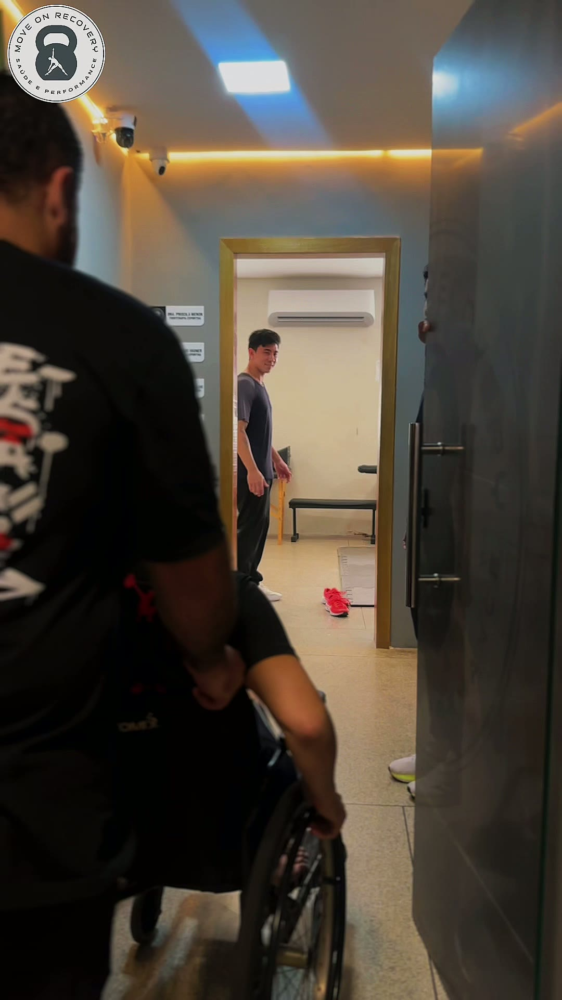
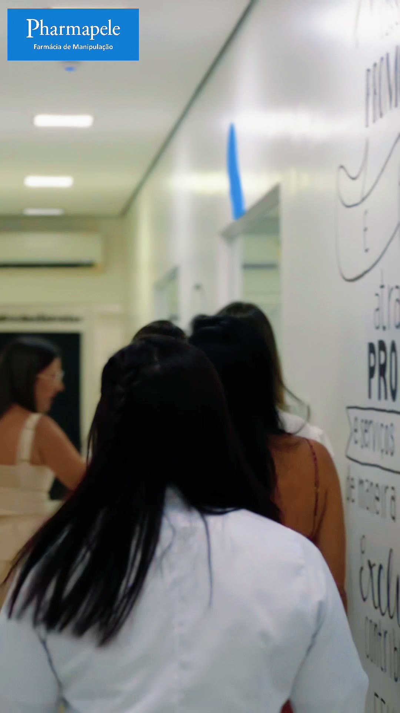
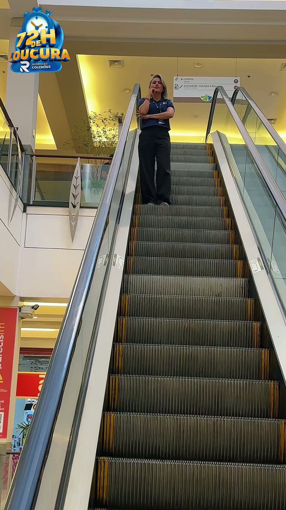

# Kássia Silva — Portfólio (Storymaker & Videomaker)

> Portfólio com foco em vídeos sensíveis e modernos para marcas que desejam se conectar. Construído com Next.js (App Router), Tailwind v4 e um design suave alinhado à identidade da Kássia.

**Prévias visuais**

<!-- Atualize/adicione mais imagens conforme necessário -->
<p align="left">
	
</p>

<p align="left">
	
	
	
</p>

---

## Tecnologias

- Next.js 15 (App Router) + React 19 (TypeScript)
- Tailwind CSS v4 (via `@tailwindcss/postcss`)
- PostCSS + CSS Variables para tema (sem `@apply`)
- `next/font` (Google): Nunito e Playfair Display
- Framer Motion (animações sutis) e Lucide React (ícones)
- Git LFS para vídeos (`.mp4/.mov/.webm`)

## Principais recursos

- Layout com tipografia elegante e paleta de marca configurada via variáveis CSS
- Componentes: Header responsivo (menu mobile), Hero, About, Brands, Projects (video grid), CTA, Footer, FAB do WhatsApp
- Players: YouTube/Vimeo embed ou vídeo local com pôster otimizado
- SEO: Metadata (OpenGraph/Twitter), `robots.txt`, `sitemap.xml` e JSON‑LD na home
- Acessibilidade: rotas, labels e comportamento do menu mobile (ESC, foco, travar scroll)

## Estrutura do projeto

```
src/
	app/
		layout.tsx       # Fonts, metadata e estilos globais
		page.tsx         # Composição das seções da home
		robots.ts        # /robots.txt
		sitemap.ts       # /sitemap.xml
	components/
		Header.tsx, Footer.tsx, Section.tsx, Chip.tsx, VideoCard.tsx
		WhatsAppButton.tsx
		sections/        # HeroSection, AboutSection, BrandsSection, ProjectsSection, CtaSection
	data/
		brands.ts, videos.ts
public/
	icon.svg           # Favicon (SVG)
	kassia.JPEG        # Imagem de capa do README/OG
	posters/**         # Pôsteres (thumbnails) gerados via ffmpeg
	videos/**          # Vídeos (rastreados com Git LFS)
```

## Rodando localmente

Requisitos: Node 18+ e npm (ou pnpm/yarn).

```cmd
npm install
npm run dev
```

Build e produção:

```cmd
npm run build
npm run start
```

Variáveis de ambiente (opcional):

- `NEXT_PUBLIC_SITE_URL` — usada em `robots.ts` e `sitemap.ts`.

## Imagens e vídeos

- Pôsteres são espelhados de `public/videos/**` para `public/posters/**` (`videoN.mp4` → `videoN.jpg`).
- Para gerar pôsteres automaticamente (Windows/PowerShell, requer `ffmpeg` no PATH):

```powershell
$rv="C:\dev\kassia\public\videos"; $rp="C:\dev\kassia\public\posters"
$videos=Get-ChildItem -Recurse -Filter *.mp4 -Path $rv
foreach($v in $videos){
	$rel=$v.FullName.Substring($rv.Length).TrimStart('\')
	$pp=Join-Path $rp ($rel -replace '.mp4$','.jpg')
	$pd=Split-Path $pp -Parent
	if(!(Test-Path $pd)){ New-Item -ItemType Directory -Path $pd -Force | Out-Null }
	if(!(Test-Path $pp)){ ffmpeg -ss 00:00:01 -i "$($v.FullName)" -frames:v 1 -q:v 3 -y "$pp" }
}
```

## Personalização rápida

- Ícone/Favicon: edite `src/app/icon.svg` (já referenciado em `metadata.icons`).
- Paleta: ajuste variáveis em `src/app/globals.css` (`:root { --color-brand-* }`).
- WhatsApp: links padronizados em Header, CTA e FAB (arquivo `CtaSection.tsx`, `Header.tsx`, `WhatsAppButton.tsx`).

## Deploy

- Pode ser publicado em Vercel (suporte nativo a Next.js App Router).
- Garanta que vídeos grandes fiquem sob Git LFS (evita pacotes gigantes no push).

---

Se este projeto te ajudou, considere dar uma ⭐️. Sugestões e PRs são bem-vindos!